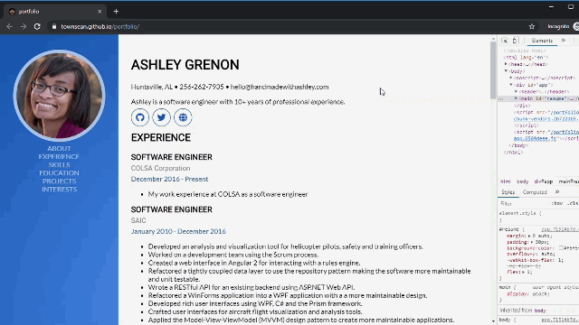

# portfolio

See in it action [here](http://townsean.github.io/portfolio/)! (work in progress)

## Synopsis

Portfolio is a Vue.js web application that reads in json data and displays the contents in a digital resume format. 



## Motivation

I felt like I was stagnating as developer and wanted to learn [Vue.js](https://vuejs.org/). Building a website version of my resume is a project that has been on my todo list. Learning by doing is a great way to make a lesson stick so I decided to learn Vue.js as I built this resume website.

I also used this project as an opportunity to become more proficient with CSS, specifically with the [CSS Flexible Box Layout](https://developer.mozilla.org/en-US/docs/Web/CSS/CSS_Flexible_Box_Layout). 

## Inspiration

I'm firm believer in giving credit where it's due. Prior to getting started, I looked online for inspiration and found several different website resumes. One of my favorites that I came accross was [Start Bootstrap's example resume](https://startbootstrap.com/previews/resume/). My website's layout and typography is largely inspired by this one. 

(I did avoid looking at the source for the example as the main purpose of this project is learning.) 

## Project setup
```
npm install
```

### Compiles and hot-reloads for development
```
npm run serve
```

### Compiles and minifies for production
```
npm run build
```

### Run tests
```
npm run test
```

### Lints and fixes files
```
npm run lint
```

### Customize configuration
See [Configuration Reference](https://cli.vuejs.org/config/).

## Push updates to gh-pages
```
git add dist && git commit -m "updating gh-pages"
git subtree push --prefix dist origin gh-pages
```

## An Easter Egg

Toggle between 2 different resume.json files with CTRL + mouse click. Not an elegant thing (*should use routes*), but I wanted to quickly demostrate that none of the data is hardcorded. 

## Built With

* [Vue.js](https://vuejs.org/)
* [vue-scrollto](https://github.com/rigor789/vue-scrollto) 
* [Font Awesome](https://fontawesome.com/how-to-use/on-the-web/using-with/vuejs)
* [Visual Studio Code](https://code.visualstudio.com/)
* [Adobe Color](https://color.adobe.com/create) (for color pallete)
* [Roboto](https://fonts.google.com/specimen/Roboto) and [Lato](https://fonts.google.com/specimen/Lato) Google Fonts

For the skill proficiency text labels I used the NIH [competencies proficiency scale](https://hr.nih.gov/working-nih/competencies/competencies-proficiency-scale) levels.

## Lessons Learned

### iOS Momentum Scrolling

I noticed sluggish scrolling on the website while browsing it on my iPhone. Initially, I thought I may have some performance issue related to my use of [vue-scrollto](https://github.com/rigor789/vue-scrollto). Turns out, momentum scrolling was disabled.

Unfortunately, most solutions to this issue use a non-standard CSS property: `--webkit-overflow-scrolling`. The property [controls whether or not touch devices use momentum scrolling](https://developer.mozilla.org/en-US/docs/Web/CSS/-webkit-overflow-scrolling).

```
section {
    --webkit-overflow-scrolling: touch;
}
```

### Build Error: This relative module was not found

So, I went back and refactored the [`SkillSection`](https://github.com/townsean/portfolio/blob/master/src/components/SkillSection.vue) to move the proficiency bar to its own component. In the process I encountered this error:

```
ERROR Failed to compile with 1 errors 6:00:20 AM

This relative module was not found:

* ./components/ProficiencyBar.vue in ./node_modules/cache-loader/dist/cjs.js??ref--12-0!./node_modules/babel-loader/lib!./node_modules/cache-loader/dist/cjs.js??ref--0-0!./node_modules/vue-loader/lib??vue-loader-options!./src/components/SkillSection.vue?vue&type=script&lang=js&
```

It took longer to find the solution to the fix that I thought it would, and I wrote a little blog post with my debugging steps and solution to the problem. [Read it here.](https://www.thecodingcouple.com/vue-js-error-this-relative-module-was-not-found/)

## What's Left to Implement?

* Subtle animations in the Skills section
* Navbar for mobile edition of the website
* ~~Jazz up the projects section~~ [Done]
* ~~Create a printer friendly style sheet~~ [Done]
* ~~Add a slight drop shadow on the navbar?~~ [Done]

## Maintainers

* [Ashley Grenon - @townsean](https://github.com/townsean)

## License (MIT)

The MIT License (MIT)
Copyright (c) 2019 Ashley Grenon

Permission is hereby granted, free of charge, to any person obtaining a copy of this software and associated documentation files (the "Software"), to deal in the Software without restriction, including without limitation the rights to use, copy, modify, merge, publish, distribute, sublicense, and/or sell copies of the Software, and to permit persons to whom the Software is furnished to do so, subject to the following conditions:

The above copyright notice and this permission notice shall be included in all copies or substantial portions of the Software.

THE SOFTWARE IS PROVIDED "AS IS", WITHOUT WARRANTY OF ANY KIND, EXPRESS OR IMPLIED, INCLUDING BUT NOT LIMITED TO THE WARRANTIES OF MERCHANTABILITY, FITNESS FOR A PARTICULAR PURPOSE AND NONINFRINGEMENT. IN NO EVENT SHALL THE AUTHORS OR COPYRIGHT HOLDERS BE LIABLE FOR ANY CLAIM, DAMAGES OR OTHER LIABILITY, WHETHER IN AN ACTION OF CONTRACT, TORT OR OTHERWISE, ARISING FROM, OUT OF OR IN CONNECTION WITH THE SOFTWARE OR THE USE OR OTHER DEALINGS IN THE SOFTWARE.
